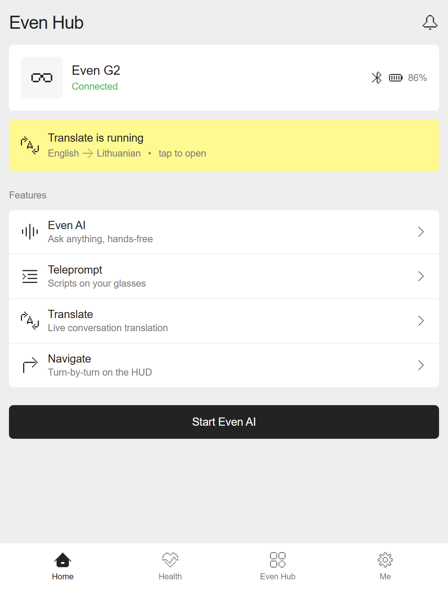

<p align="center">
  <strong>evenhub-app-ui</strong>
</p>

<p align="center">
  Even Realities G2 design system as a Claude Code skill.<br>
  Even Hub APP design guidelines · color tokens · type scale · <strong>191 official pixel icons bundled</strong>.
</p>

<p align="center">
  <a href="https://docs.anthropic.com/en/docs/claude-code"></a>
  <a href="https://github.com/JustinasLa/evenhub-app-ui/commits/master"></a>
  <a href="LICENSE"></a>
</p>

---

evenhub-app-ui is a skill/plugin for [Claude Code](https://docs.anthropic.com/en/docs/claude-code). Install once, and whenever you design or build UI for the Even Hub companion app, Claude applies the official design guidelines automatically: exact hex tokens, FK Grotesk Neue typography, margin & spacing metrics, and pixel-icon construction rules.

Distilled from the public Figma file **"Even Realities – Software Design Guidelines"** (UIUX Design Guidelines 2025), APP Guidelines page.

> **Looking for glasses HUD (Even OS) guidelines?** Those are covered by the official [everything-evenhub](https://github.com/even-realities/everything-evenhub) plugin — this skill deliberately sticks to the companion APP to avoid duplicating it.

## Demo

Even Hub home screen built by Claude Code with this skill active — official color tokens, 12px margins, squircle cards, and the bundled pixel icons (glasses, Bluetooth, battery, feature icons, menu bar), no manual design input:

<p align="center">
  
</p>

## What's inside

```
skills/evenhub-app-ui/
  SKILL.md                        entry point — quick-facts table, when to apply what
  references/
    app-guidelines.md             APP: TC/BC/SC color tokens, 8-step type scale,
                                  margins (12/16px), spacing (0/6/12/24px),
                                  radius (6px + 60% smoothing), component inventory
    iconography.md                icon construction (32×32 grid, 2×2px unit, do's/don'ts)
                                  + full inventory of the bundled set
  assets/icons/                   191 official SVGs in 7 categories:
                                  Menu Bar · Feature & Function · Edit & Settings ·
                                  Guide System · Health · Navigate · Status

skills/evenhub-pixel-icons/
  SKILL.md                        create NEW icons in the official pixel style when
                                  the bundled set lacks the metaphor — authentic SVG
                                  anatomy, grid-first workflow, verification checklist
  scripts/grid2svg.mjs            deterministic ASCII-grid → pixel-icon SVG converter
```

## Install

**Plugin marketplace. Two commands.**

```bash
# inside Claude Code
/plugin marketplace add JustinasLa/evenhub-app-ui
/plugin install evenhub-app-ui@evenhub-app-ui
```

Then `/reload-plugins` (or restart Claude Code). Safe to re-run.

<details>
<summary><strong>Manual install (no plugin system)</strong></summary>

<br>

Copy the skill folder into a skills directory:

```bash
# personal (all projects)
~/.claude/skills/evenhub-app-ui/

# or per-project
<your-project>/.claude/skills/evenhub-app-ui/
```

Copy the whole folder [`skills/evenhub-app-ui/`](skills/evenhub-app-ui/) — SKILL.md plus `references/` and `assets/icons/` — so the icon paths keep working.

</details>

## Usage

No command needed — the skill triggers when the conversation involves Even Realities / G2 / Even Hub app design or implementation. You can also invoke it explicitly:

```
/evenhub-app-ui
```

Typical asks it improves:

- "Build the settings screen for our G2 companion app" → correct tokens (#232323 / #EEEEEE / #FEF991…), 12px screen margins, 6px squircle cards, FK type scale.
- "Need a battery icon" → uses the bundled `Status Icons/Battery_Low.svg` instead of inventing one.
- "Need a WiFi icon and the set has none" → the `evenhub-pixel-icons` skill kicks in and draws a new SVG that matches the official style (32×32 grid, 2×2px unit, stepped corners, `#232323` fill).

## Icon set

The 191 SVGs under [`skills/evenhub-app-ui/assets/icons/`](skills/evenhub-app-ui/assets/icons/) were exported from the APP section of the public Figma file. Pixel-grid style is part of the brand: use them verbatim, render at 24×24 (or integer multiples), don't recolor outside the token palette.

| Category | Count | Examples |
|---|---|---|
| Status Icons | 55 | Battery_Full, Bluetooth, Glasses Charging, Alert |
| Feature & Function | 41 | Even AI, Teleprompt, Translate, Navigate, Weather |
| Edit & Settings | 32 | Add, Edit, Trash, Undo, Settings |
| Navigate Feature | 23 | Compass, Location, Restaurant, Train |
| Guide System | 20 | Chevrons, Single/Double Tap, Long Press, Swipe |
| Health Feature | 12 | Heart rate, HRV, Sleep, Steps |
| Menu Bar | 8 | Home/Health/Even hub/Me-Account (+ Highlighted) |

## Test: creating new icons (`evenhub-pixel-icons`)

Ran the `evenhub-pixel-icons` skill end-to-end to create two icons whose metaphors are missing from the bundled 191-icon set. Same workflow both times: sketch on the skill's 16×16 ASCII grid (1 cell = 2×2px), then convert with the bundled `scripts/grid2svg.mjs` for a deterministic, spec-compliant SVG (32×32 viewBox, `#232323` fill, axis-aligned bars only, no strokes/curves).

<table align="center">
  <tr>
    <td align="center"></td>
    <td align="center"></td>
  </tr>
  <tr>
    <td align="center"><a href="icons/custom/Coffee%20Cup.svg"><strong>Coffee Cup</strong></a></td>
    <td align="center"><a href="icons/custom/Cactus.svg"><strong>Cactus</strong></a></td>
  </tr>
  <tr>
    <td align="center">Claude Sonnet 5 · low effort<br>(reasoning effort 20)</td>
    <td align="center">Claude Opus 4.8 · default effort</td>
  </tr>
</table>

Both pass the skill's verification checklist: 32×32 viewBox, no `stroke`, no curve commands, all bars/steps in multiples of 2px, single `#232323` fill, 2px padding respected, legible at 24×24.

<details>
<summary><strong>Coffee Cup — prompt, grid, SVG</strong></summary>

<br>

**Prompt given to Claude:**
> Run a test creating a coffee cup icon for even realities. Save the prompt you use and the output to be displayed in README of evenhub-app-ui repo. Mention which model and effort was used to create it.

**Process:** sketched the mug on the ASCII grid — outline body, C-shaped handle, two steam puffs above.

**ASCII grid:**

```
................
................
......#..#......
......#..#......
................
................
....#######.....
....#.....#.....
....#.....###...
....#.....#.#...
....#.....#.#...
....#.....###...
....#.....#.....
....#######.....
................
................
```

**Output SVG** — saved at [`icons/custom/Coffee Cup.svg`](icons/custom/Coffee%20Cup.svg):

```svg
<svg width="32" height="32" viewBox="0 0 32 32" fill="none" xmlns="http://www.w3.org/2000/svg">
<rect x="12" y="4" width="2" height="2" fill="#232323"/>
<rect x="18" y="4" width="2" height="2" fill="#232323"/>
<rect x="12" y="6" width="2" height="2" fill="#232323"/>
<rect x="18" y="6" width="2" height="2" fill="#232323"/>
<rect x="8" y="12" width="14" height="2" fill="#232323"/>
<rect x="8" y="14" width="2" height="2" fill="#232323"/>
<rect x="20" y="14" width="2" height="2" fill="#232323"/>
<rect x="8" y="16" width="2" height="2" fill="#232323"/>
<rect x="20" y="16" width="6" height="2" fill="#232323"/>
<rect x="8" y="18" width="2" height="2" fill="#232323"/>
<rect x="20" y="18" width="2" height="2" fill="#232323"/>
<rect x="24" y="18" width="2" height="2" fill="#232323"/>
<rect x="8" y="20" width="2" height="2" fill="#232323"/>
<rect x="20" y="20" width="2" height="2" fill="#232323"/>
<rect x="24" y="20" width="2" height="2" fill="#232323"/>
<rect x="8" y="22" width="2" height="2" fill="#232323"/>
<rect x="20" y="22" width="6" height="2" fill="#232323"/>
<rect x="8" y="24" width="2" height="2" fill="#232323"/>
<rect x="20" y="24" width="2" height="2" fill="#232323"/>
<rect x="8" y="26" width="14" height="2" fill="#232323"/>
</svg>
```

</details>

<details>
<summary><strong>Cactus — prompt, grid, SVG</strong></summary>

<br>

**Prompt given to Claude:**
> now do one for a cactus icon, same thing, mention model and etc

**ASCII grid** — two-armed saguaro in a pot:

```
................
................
......####......
......#..#......
......#..####...
...####..#..#...
...#..#..#..#...
...#..#..#..#...
...#..#..####...
...####..#......
......#..#......
......#..#......
....########....
....#......#....
....########....
................
```

**Output SVG** — saved at [`icons/custom/Cactus.svg`](icons/custom/Cactus.svg):

```svg
<svg width="32" height="32" viewBox="0 0 32 32" fill="none" xmlns="http://www.w3.org/2000/svg">
<rect x="12" y="4" width="8" height="2" fill="#232323"/>
<rect x="12" y="6" width="2" height="2" fill="#232323"/>
<rect x="18" y="6" width="2" height="2" fill="#232323"/>
<rect x="12" y="8" width="2" height="2" fill="#232323"/>
<rect x="18" y="8" width="8" height="2" fill="#232323"/>
<rect x="6" y="10" width="8" height="2" fill="#232323"/>
<rect x="18" y="10" width="2" height="2" fill="#232323"/>
<rect x="24" y="10" width="2" height="2" fill="#232323"/>
<rect x="6" y="12" width="2" height="2" fill="#232323"/>
<rect x="12" y="12" width="2" height="2" fill="#232323"/>
<rect x="18" y="12" width="2" height="2" fill="#232323"/>
<rect x="24" y="12" width="2" height="2" fill="#232323"/>
<rect x="6" y="14" width="2" height="2" fill="#232323"/>
<rect x="12" y="14" width="2" height="2" fill="#232323"/>
<rect x="18" y="14" width="2" height="2" fill="#232323"/>
<rect x="24" y="14" width="2" height="2" fill="#232323"/>
<rect x="6" y="16" width="2" height="2" fill="#232323"/>
<rect x="12" y="16" width="2" height="2" fill="#232323"/>
<rect x="18" y="16" width="8" height="2" fill="#232323"/>
<rect x="6" y="18" width="8" height="2" fill="#232323"/>
<rect x="18" y="18" width="2" height="2" fill="#232323"/>
<rect x="12" y="20" width="2" height="2" fill="#232323"/>
<rect x="18" y="20" width="2" height="2" fill="#232323"/>
<rect x="12" y="22" width="2" height="2" fill="#232323"/>
<rect x="18" y="22" width="2" height="2" fill="#232323"/>
<rect x="8" y="24" width="16" height="2" fill="#232323"/>
<rect x="8" y="26" width="2" height="2" fill="#232323"/>
<rect x="22" y="26" width="2" height="2" fill="#232323"/>
<rect x="8" y="28" width="16" height="2" fill="#232323"/>
</svg>
```

</details>

## Credits & license

Design guidelines and icon artwork © [Even Realities](https://www.evenrealities.com) — published by them as a public Figma resource for developers building on G2. This repo repackages that public resource for Claude Code workflows; not affiliated with or endorsed by Even Realities.

Skill text and packaging: MIT — see [LICENSE](LICENSE).
