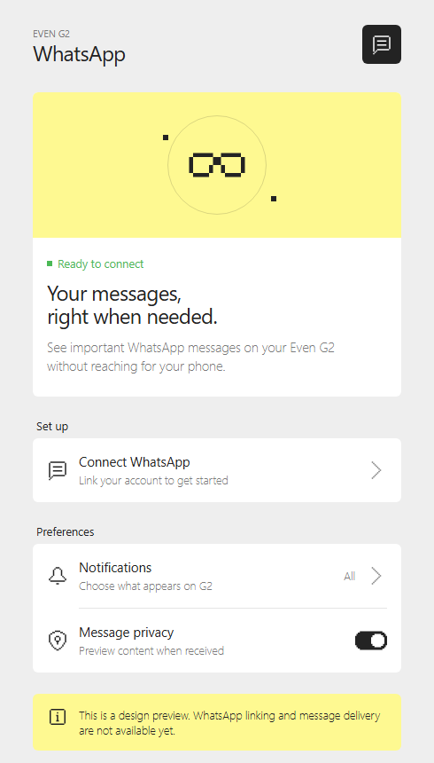
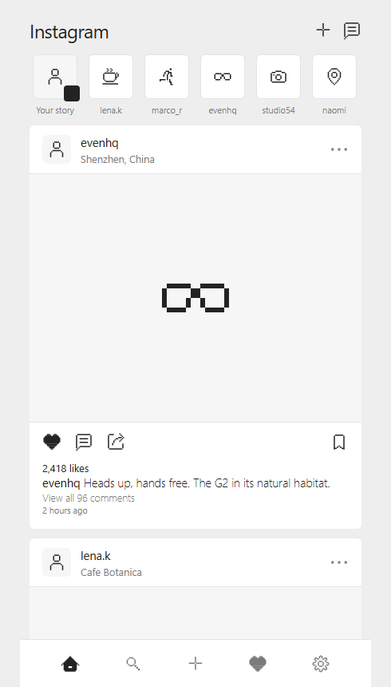

<p align="center">
  <strong>evenhub-app-ui</strong>
</p>

<p align="center">
  Even Realities G2 design system for Claude Code and Codex.<br>
  Even Hub APP design guidelines · color tokens · type scale · <strong>193 official SVG assets bundled</strong>.
</p>

<p align="center">
  <a href="https://docs.anthropic.com/en/docs/claude-code"></a>
  <a href="https://developers.openai.com/codex/"></a>
  <a href="https://github.com/JustinasLa/evenhub-app-ui/commits/master"></a>
  <a href="LICENSE"></a>
</p>

---

evenhub-app-ui is a skill/plugin for [Claude Code](https://docs.anthropic.com/en/docs/claude-code) and [Codex](https://developers.openai.com/codex/). Install once, and your coding agent applies the official design guidelines whenever you design or build UI for the Even Hub companion app: exact hex tokens, FK Grotesk Neue typography, margin and spacing metrics, and pixel-icon construction rules.

Distilled from the public Figma file **"Even Realities – Software Design Guidelines"** (UIUX Design Guidelines 2025), APP Guidelines page.

> **Looking for glasses HUD (Even OS) guidelines?** Those are covered by the official [everything-evenhub](https://github.com/even-realities/everything-evenhub) plugin — this skill deliberately sticks to the companion APP to avoid duplicating it.

## What's inside

```
skills/evenhub-app-ui/
  SKILL.md                        entry point — quick-facts table, when to apply what
  references/
    app-guidelines.md             APP: TC/BC/SC color tokens, 8-step type scale,
                                  margins (12/16px), spacing (0/6/12/24px),
                                  radius (6px + 60% smoothing), component inventory
    iconography.md                icon construction (32×32 grid, 2×2px unit, do's/don'ts)
                                  + full inventory of the bundled set
  assets/icons/                   193 official SVGs in 7 categories:
                                  Menu Bar · Feature & Function · Edit & Settings ·
                                  Guide System · Health · Navigate · Status

skills/evenhub-pixel-icons/
  SKILL.md                        create NEW icons in the official pixel style when
                                  the bundled set lacks the metaphor — authentic SVG
                                  anatomy, grid-first workflow, verification checklist
  scripts/grid2svg.mjs            deterministic ASCII-grid → pixel-icon SVG converter
```

## Install

### One command — all detected agents

Requires Node.js 18 or newer. The installer detects supported agents, installs
both skills globally, and skips agents that are not present.

```bash
# macOS · Linux · WSL · Git Bash
curl -fsSL https://raw.githubusercontent.com/JustinasLa/evenhub-app-ui/master/install.sh | bash
```

```powershell
# Windows · PowerShell 5.1+
irm https://raw.githubusercontent.com/JustinasLa/evenhub-app-ui/master/install.ps1 | iex
```

Preview first with `--dry-run`, inspect detection with `--list`, or target one
agent with `--only codex` or `--only claude-code`. The installer is safe to
re-run; use `--force` to replace existing copies and `--uninstall` to remove
both skills.

### Codex

The repository includes a native `.codex-plugin/plugin.json` manifest and
Codex UI metadata for both bundled skills.

In the Codex app, clone or open this repository, then use **Settings → General
→ Import other agent setup** and select the plugin when prompted. Start a new
thread after import. You can invoke the plugin or either skill explicitly with
`@evenhub-app-ui`, `$evenhub-app-ui`, or `$evenhub-pixel-icons`.

For local marketplace development, add this plugin directory to a Codex
personal or repository marketplace, restart Codex, then install it from
`/plugins`.

### Claude Code

**Plugin marketplace. Two commands.**

```bash
# inside Claude Code
/plugin marketplace add JustinasLa/evenhub-app-ui
/plugin install evenhub-app-ui@evenhub-app-ui
```

Then `/reload-plugins` (or restart Claude Code). Safe to re-run.

<details>
<summary><strong>Manual install (no plugin system)</strong></summary>

<br>

Copy the skill folder into a skills directory:

```bash
# personal (all projects)
~/.claude/skills/evenhub-app-ui/

# or per-project
<your-project>/.claude/skills/evenhub-app-ui/
```

Copy the whole folder [`skills/evenhub-app-ui/`](skills/evenhub-app-ui/) — SKILL.md plus `references/` and `assets/icons/` — so the icon paths keep working.

</details>

## Usage

No command needed — the skill triggers when the conversation involves Even Realities / G2 / Even Hub app design or implementation. You can also invoke it explicitly:

```
/evenhub-app-ui
```

Typical asks it improves:

- "Build the settings screen for our G2 companion app" → correct tokens (#232323 / #EEEEEE / #FEF991…), 12px screen margins, 6px squircle cards, FK type scale.
- "Need a battery icon" → uses the bundled `Status Icons/Battery_Low.svg` instead of inventing one.
- "Need a WiFi icon and the set has none" → the `evenhub-pixel-icons` skill kicks in and draws a new SVG that matches the official style (32×32 grid, 2×2px unit, stepped corners, `#232323` fill).

## Icon set

The 193 SVGs under [`skills/evenhub-app-ui/assets/icons/`](skills/evenhub-app-ui/assets/icons/) were exported from the APP section of the public Figma file. Pixel-grid style is part of the brand: use icons verbatim at 24×24 (or integer multiples) and the paired toggle controls at their native 36×24 size. Don't recolor outside the token palette.

| Category | Count | Examples |
|---|---|---|
| Status Icons | 56 | Battery_Full, Bluetooth, Glasses Charging, Alert |
| Feature & Function | 42 | Even AI, Teleprompt, Translate, Toggle On/Off, Weather |
| Edit & Settings | 32 | Add, Edit, Trash, Undo, Settings |
| Navigate Feature | 23 | Compass, Location, Restaurant, Train |
| Guide System | 20 | Chevrons, Single/Double Tap, Long Press, Swipe |
| Health Feature | 12 | Heart rate, HRV, Sleep, Steps |
| Menu Bar | 8 | Home/Health/Even hub/Me-Account (+ Highlighted) |

## Test: designing companion apps (`evenhub-app-ui`)

Ran the `evenhub-app-ui` skill to design two phone companion app concepts. These tests cover visual design only; no functionality is implemented.

<table align="center">
  <tr>
    <td align="center"></td>
    <td align="center"></td>
  </tr>
  <tr>
    <td align="center"><strong>WhatsApp companion app</strong></td>
    <td align="center"><strong>Instagram companion app</strong></td>
  </tr>
  <tr>
    <td align="center">Prompt: “create an even g2 app for whatsapp.<br>There is no functionality for now,<br>only design for phone.”</td>
    <td align="center">Prompt: “Redesign instagram to look like<br>instagram. Just follow the skill”</td>
  </tr>
  <tr>
    <td align="center">Phone-only design concept</td>
    <td align="center">Phone-only design concept</td>
  </tr>
</table>

Both results use the Even Hub visual language: a near-monochrome palette, yellow accent states, green connection status, grouped cards, clear title/body hierarchy, and pixel-style interface icons.

## Test: creating new icons (`evenhub-pixel-icons`)

Ran the `evenhub-pixel-icons` skill end-to-end to create four custom icon tests. Same workflow each time: sketch on the skill's 16×16 ASCII grid (1 cell = 2×2px), then convert with the bundled `scripts/grid2svg.mjs` for a deterministic, spec-compliant SVG (32×32 viewBox, `#232323` fill, axis-aligned bars only, no strokes/curves). The final coffee cup is an intentionally generated variant; in normal use, the bundled `Coffee shop` icon should be reused because it is already a close match.

<table align="center">
  <tr>
    <td align="center"></td>
    <td align="center"></td>
    <td align="center"></td>
    <td align="center"></td>
  </tr>
  <tr>
    <td align="center"><a href="icons/custom/Coffee%20Cup.svg"><strong>Coffee Cup</strong></a></td>
    <td align="center"><a href="icons/custom/Cactus.svg"><strong>Cactus</strong></a></td>
    <td align="center"><a href="icons/custom/Dog%20Face.svg"><strong>Dog Face</strong></a></td>
    <td align="center"><a href="icons/custom/Coffee%20Cup%20Codex.svg"><strong>Coffee Cup (Codex)</strong></a></td>
  </tr>
  <tr>
    <td align="center">Claude Sonnet 5 · low effort<br>(reasoning effort 20)</td>
    <td align="center">Claude Opus 4.8 · default effort</td>
    <td align="center">Codex (GPT-5) · default effort</td>
    <td align="center">Codex (GPT-5) · default effort</td>
  </tr>
</table>

All four pass the skill's verification checklist: 32×32 viewBox, no `stroke`, no curve commands, all bars/steps in multiples of 2px, single `#232323` fill, standard padding respected, legible at 24×24.

<details>
<summary><strong>Coffee Cup — prompt, grid, SVG</strong></summary>

<br>

**Prompt given to Claude:**
> Create a coffee cup icon for even realities.

**Process:** sketched the mug on the ASCII grid — outline body, C-shaped handle, two steam puffs above.

**ASCII grid:**

```
................
................
......#..#......
......#..#......
................
................
....#######.....
....#.....#.....
....#.....###...
....#.....#.#...
....#.....#.#...
....#.....###...
....#.....#.....
....#######.....
................
................
```

**Output SVG** — saved at [`icons/custom/Coffee Cup.svg`](icons/custom/Coffee%20Cup.svg):

```svg
<svg width="32" height="32" viewBox="0 0 32 32" fill="none" xmlns="http://www.w3.org/2000/svg">
<rect x="12" y="4" width="2" height="2" fill="#232323"/>
<rect x="18" y="4" width="2" height="2" fill="#232323"/>
<rect x="12" y="6" width="2" height="2" fill="#232323"/>
<rect x="18" y="6" width="2" height="2" fill="#232323"/>
<rect x="8" y="12" width="14" height="2" fill="#232323"/>
<rect x="8" y="14" width="2" height="2" fill="#232323"/>
<rect x="20" y="14" width="2" height="2" fill="#232323"/>
<rect x="8" y="16" width="2" height="2" fill="#232323"/>
<rect x="20" y="16" width="6" height="2" fill="#232323"/>
<rect x="8" y="18" width="2" height="2" fill="#232323"/>
<rect x="20" y="18" width="2" height="2" fill="#232323"/>
<rect x="24" y="18" width="2" height="2" fill="#232323"/>
<rect x="8" y="20" width="2" height="2" fill="#232323"/>
<rect x="20" y="20" width="2" height="2" fill="#232323"/>
<rect x="24" y="20" width="2" height="2" fill="#232323"/>
<rect x="8" y="22" width="2" height="2" fill="#232323"/>
<rect x="20" y="22" width="6" height="2" fill="#232323"/>
<rect x="8" y="24" width="2" height="2" fill="#232323"/>
<rect x="20" y="24" width="2" height="2" fill="#232323"/>
<rect x="8" y="26" width="14" height="2" fill="#232323"/>
</svg>
```

</details>

<details>
<summary><strong>Cactus — prompt, grid, SVG</strong></summary>

<br>

**Prompt given to Claude:**
> now do one for a cactus icon

**ASCII grid** — two-armed saguaro in a pot:

```
................
................
......####......
......#..#......
......#..####...
...####..#..#...
...#..#..#..#...
...#..#..#..#...
...#..#..####...
...####..#......
......#..#......
......#..#......
....########....
....#......#....
....########....
................
```

**Output SVG** — saved at [`icons/custom/Cactus.svg`](icons/custom/Cactus.svg):

```svg
<svg width="32" height="32" viewBox="0 0 32 32" fill="none" xmlns="http://www.w3.org/2000/svg">
<rect x="12" y="4" width="8" height="2" fill="#232323"/>
<rect x="12" y="6" width="2" height="2" fill="#232323"/>
<rect x="18" y="6" width="2" height="2" fill="#232323"/>
<rect x="12" y="8" width="2" height="2" fill="#232323"/>
<rect x="18" y="8" width="8" height="2" fill="#232323"/>
<rect x="6" y="10" width="8" height="2" fill="#232323"/>
<rect x="18" y="10" width="2" height="2" fill="#232323"/>
<rect x="24" y="10" width="2" height="2" fill="#232323"/>
<rect x="6" y="12" width="2" height="2" fill="#232323"/>
<rect x="12" y="12" width="2" height="2" fill="#232323"/>
<rect x="18" y="12" width="2" height="2" fill="#232323"/>
<rect x="24" y="12" width="2" height="2" fill="#232323"/>
<rect x="6" y="14" width="2" height="2" fill="#232323"/>
<rect x="12" y="14" width="2" height="2" fill="#232323"/>
<rect x="18" y="14" width="2" height="2" fill="#232323"/>
<rect x="24" y="14" width="2" height="2" fill="#232323"/>
<rect x="6" y="16" width="2" height="2" fill="#232323"/>
<rect x="12" y="16" width="2" height="2" fill="#232323"/>
<rect x="18" y="16" width="8" height="2" fill="#232323"/>
<rect x="6" y="18" width="8" height="2" fill="#232323"/>
<rect x="18" y="18" width="2" height="2" fill="#232323"/>
<rect x="12" y="20" width="2" height="2" fill="#232323"/>
<rect x="18" y="20" width="2" height="2" fill="#232323"/>
<rect x="12" y="22" width="2" height="2" fill="#232323"/>
<rect x="18" y="22" width="2" height="2" fill="#232323"/>
<rect x="8" y="24" width="16" height="2" fill="#232323"/>
<rect x="8" y="26" width="2" height="2" fill="#232323"/>
<rect x="22" y="26" width="2" height="2" fill="#232323"/>
<rect x="8" y="28" width="16" height="2" fill="#232323"/>
</svg>
```

</details>

<details>
<summary><strong>Dog Face — prompt, grid, SVG</strong></summary>

<br>

**Prompt given to Codex:**
> Create a Dog face Icon

**Process:** confirmed the bundled set had no dog, pet, or animal icon; then used the official `Account`, `3D Facial Scan`, and `Good` icons as references for the stepped head silhouette, sparse facial marks, and expression rhythm. The source grid was vertically centered before regeneration, leaving 4px padding above and below.

**ASCII grid:**

```
................
................
..##........##..
..###......###..
..#.##....##.#..
..#..######..#..
..#..........#..
..#..##..##..#..
..#..........#..
..#....##....#..
..#...####...#..
...#...##...#...
....##....##....
.....######.....
................
................
```

**Output SVG** — saved at [`icons/custom/Dog Face.svg`](icons/custom/Dog%20Face.svg), with the retained source at [`icons/custom/Dog Face.grid`](icons/custom/Dog%20Face.grid):

```svg
<svg width="32" height="32" viewBox="0 0 32 32" fill="none" xmlns="http://www.w3.org/2000/svg">
  <rect x="4" y="4" width="4" height="2" fill="#232323"/>
  <rect x="24" y="4" width="4" height="2" fill="#232323"/>
  <rect x="4" y="6" width="6" height="2" fill="#232323"/>
  <rect x="22" y="6" width="6" height="2" fill="#232323"/>
  <rect x="4" y="8" width="2" height="2" fill="#232323"/>
  <rect x="8" y="8" width="4" height="2" fill="#232323"/>
  <rect x="20" y="8" width="4" height="2" fill="#232323"/>
  <rect x="26" y="8" width="2" height="2" fill="#232323"/>
  <rect x="4" y="10" width="2" height="2" fill="#232323"/>
  <rect x="10" y="10" width="12" height="2" fill="#232323"/>
  <rect x="26" y="10" width="2" height="2" fill="#232323"/>
  <rect x="4" y="12" width="2" height="2" fill="#232323"/>
  <rect x="26" y="12" width="2" height="2" fill="#232323"/>
  <rect x="4" y="14" width="2" height="2" fill="#232323"/>
  <rect x="10" y="14" width="4" height="2" fill="#232323"/>
  <rect x="18" y="14" width="4" height="2" fill="#232323"/>
  <rect x="26" y="14" width="2" height="2" fill="#232323"/>
  <rect x="4" y="16" width="2" height="2" fill="#232323"/>
  <rect x="26" y="16" width="2" height="2" fill="#232323"/>
  <rect x="4" y="18" width="2" height="2" fill="#232323"/>
  <rect x="14" y="18" width="4" height="2" fill="#232323"/>
  <rect x="26" y="18" width="2" height="2" fill="#232323"/>
  <rect x="4" y="20" width="2" height="2" fill="#232323"/>
  <rect x="12" y="20" width="8" height="2" fill="#232323"/>
  <rect x="26" y="20" width="2" height="2" fill="#232323"/>
  <rect x="6" y="22" width="2" height="2" fill="#232323"/>
  <rect x="14" y="22" width="4" height="2" fill="#232323"/>
  <rect x="24" y="22" width="2" height="2" fill="#232323"/>
  <rect x="8" y="24" width="4" height="2" fill="#232323"/>
  <rect x="20" y="24" width="4" height="2" fill="#232323"/>
  <rect x="10" y="26" width="12" height="2" fill="#232323"/>
</svg>
```

</details>

<details>
<summary><strong>Coffee Cup (Codex) — prompt, grid, SVG</strong></summary>

<br>

**Prompt given to Codex:**
> Now test the same skill but with a coffee cup

**Process:** The bundled `Coffee shop`, `Restaurant`, and `Hotel` icons informed the sparse stepped geometry. This is a deliberate generation test despite `Coffee shop` already being a reusable official match.

**ASCII grid:**

```
................
................
.......##.......
......##........
.......##.......
................
...########.....
...#......###...
...#......#..#..
...#......#..#..
...#......###...
....#....#......
.....####.......
...##########...
................
................
```

**Output SVG** — saved at [`icons/custom/Coffee Cup Codex.svg`](icons/custom/Coffee%20Cup%20Codex.svg), with the retained source at [`icons/custom/Coffee Cup Codex.grid`](icons/custom/Coffee%20Cup%20Codex.grid):

```svg
<svg width="32" height="32" viewBox="0 0 32 32" fill="none" xmlns="http://www.w3.org/2000/svg">
  <rect x="14" y="4" width="4" height="2" fill="#232323"/>
  <rect x="12" y="6" width="4" height="2" fill="#232323"/>
  <rect x="14" y="8" width="4" height="2" fill="#232323"/>
  <rect x="6" y="12" width="16" height="2" fill="#232323"/>
  <rect x="6" y="14" width="2" height="2" fill="#232323"/>
  <rect x="20" y="14" width="6" height="2" fill="#232323"/>
  <rect x="6" y="16" width="2" height="2" fill="#232323"/>
  <rect x="20" y="16" width="2" height="2" fill="#232323"/>
  <rect x="26" y="16" width="2" height="2" fill="#232323"/>
  <rect x="6" y="18" width="2" height="2" fill="#232323"/>
  <rect x="20" y="18" width="2" height="2" fill="#232323"/>
  <rect x="26" y="18" width="2" height="2" fill="#232323"/>
  <rect x="6" y="20" width="2" height="2" fill="#232323"/>
  <rect x="20" y="20" width="6" height="2" fill="#232323"/>
  <rect x="8" y="22" width="2" height="2" fill="#232323"/>
  <rect x="18" y="22" width="2" height="2" fill="#232323"/>
  <rect x="10" y="24" width="8" height="2" fill="#232323"/>
  <rect x="6" y="26" width="20" height="2" fill="#232323"/>
</svg>
```

</details>

## Credits & license

Design guidelines and icon artwork © [Even Realities](https://www.evenrealities.com) — published by them as a public Figma resource for developers building on G2. This repo repackages that public resource for Claude Code workflows; not affiliated with or endorsed by Even Realities.

Skill text and packaging: MIT — see [LICENSE](LICENSE).
